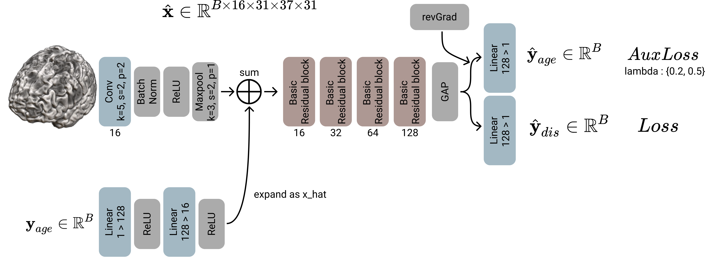

# Age_Prediction_for_AD_Diagnosis

## Overall framework
1. Brain atrophy can be generated by either aging or brain disease.
2. For accurate AD diagnosis, brain atrophy caused by aging should be regularized.
3. In this project, the model forced not to train structual changes occurred by chronological age.
4. The "revGrad" techinque has been used in this project.

</img>

